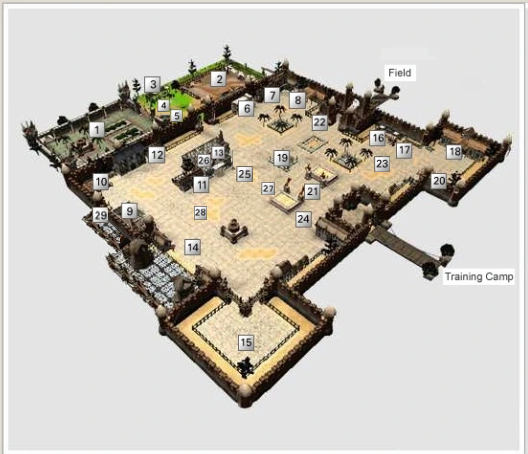

## Armia 

Este é o local onde os humanos começaram a se reunir novamente no mundo devastado pela guerra contra as criaturas malignas. Ainda existem muitas criaturas malignas fora desta cidade, e para proteger a cidade dessas criaturas, todos os moradores construíram uma grande muralha que é defendida 24 horas por dia pela cavalaria real.
  
Os jogadores que iniciam pela primeira vez no WYD Brazuca começam nesta cidade chamada Armia.
  
Dentro da cidade, existem comerciantes e artesãos que vendem equipamentos básicos, e também o guarda carga, que possibilita aos aventureiros depositar os itens e ter acesso ao banco que pode ser usado por todos os personagens de uma mesma conta. Existem também nesta cidade os Skillmasters que possibilitam a aprendizagem das skills respectivas a sua classe de personagem.
  
O portão sul da cidade de Armia atualmente esta bloqueado; ele leva ao campo adjacente da cidade, e o Portão Leste é ligado ao campo de treino para os jogadores iniciantes.

 

 

<table align="center">
    <tr align="center">
        <td><strong>Num.</strong></td>
        <td><strong>Nome</strong></td>
        <td><strong>Descrição</strong></td>
    </tr>
    <tr align="center">
        <td>1</tdr>
        <td>Zona da Guild</td>
        <td>Zona de Guilda da Guild campeã da cidade de Armia. Entrada permitida apenas para membros da Guilda relacionada.</td>
    </tr>
    <tr align="center">
        <td>2</tdr>
        <td>Zona PvP</td>
        <td>Local que permite combate entre jogadores.</td>
    </tr>
    <tr align="center">
        <td>3</tdr>
        <td>Martin</td>
        <td>Vende itens de recuperação, pergaminhos, etc.</td>
    </tr>
    <tr align="center">
        <td>4</tdr>
        <td>Balmus</td>
        <td>Recebe inscrição para Guerra de Guild contra a Guild campeã da cidade de Armia.</td>
    </tr>
    <tr align="center">
        <td>5</tdr>
        <td>PremioArmia</td>
        <td>NPC responsável por entregar o prêmio pela participação na Guerra da Cidade de Armia.</td>
    </tr>
    <tr align="center">
        <td>6</tdr>
        <td>Rainy</td>
        <td>Vende itens de defesa para Huntress.</td>
    </tr>
    <tr align="center">
        <td>7</tdr>
        <td>NPC's  ForeLeaner e  Knight Leader</td>
        <td>Mestre de Skill da Huntress e do Transknight. Permite aprender Skill de Huntress e Transknight</td>
    </tr>
    <tr align="center">
        <td>8</tdr>
        <td>Smith</td>
        <td>Vende itens de defesa para Transknight</td>
    </tr>
    <tr align="center">
        <td>9</tdr>
        <td>Setumbra</td>
        <td>NPC responsável pela Composição do Set Umbral</td>
    </tr>
    <tr align="center">
        <td>10</tdr>
        <td>NPC's ArchiMaster e Arnold</td>
        <td>Mestre de Skill do Beastmaster. Permite aprender Skill de Beastmaster Vende itens de defesa para Beastmaster.</td>
    </tr>
    <tr align="center">
        <td>11</tdr>
        <td>Eirikr</td>
        <td>Vende diversos itens que apenas podem ser comprados com Moedas de Ouro que você ganha deixando seu personagem com Auto-venda aberta.</td>
    </tr>
    <tr align="center">
        <td>12</tdr>
        <td>NPC's  Rapein e Elder Forema</td>
        <td>Mestre de Skill da Foema. Permite aprender Skill da Foema Vende itens de defesa para Foema.</td>
    </tr>
    <tr align="center">
        <td>13</tdr>
        <td>NPC Cargo Guard</td>
        <td>NPC responsável por guardar itens do personagem.</td>
    </tr>
    <tr align="center">
        <td>14</tdr>
        <td>NPC Galford</td>
        <td>Vende vários tipos de armamentos.</td>
    </tr>
    <tr align="center">
        <td>15</tdr>
        <td>Gold Dragon</td>
        <td>Adiciona atributos na arma equipada caso leve os 7 cristais e/ou abre os baús de tesouro</td>
    </tr>
    <tr align="center">
        <td>16</tdr>
        <td>Aki</td>
        <td>Vende itens de poções, Pergaminhos, Safiras e Entradas para os Calabouços</td>
    </tr>
    <tr align="center">
        <td>17</tdr>
        <td>Cargo Guard</td>
        <td>NPC responsável por guardar itens do personagem.</td>
    </tr>
    <tr align="center">
        <td>18</tdr>
        <td>Ability Master</td>
        <td>NPC responsável por reconfigurar parte dos pontos de habilidade ao levar Safiras a ela.</td>
    </tr>
    <tr align="center">
        <td>19</tdr>
        <td>Zona de Teleporte</td>
        <td>Teleporta para o Castelo de Noatun</td>
    </tr>
    <tr align="center">
        <td>20</tdr>
        <td>Zona de Teleporte</td>
        <td>Teleporta para a região do Campo de Armia próximo a entrada para as Dungeons.</td>
    </tr>
    <tr align="center">
        <td>21</tdr>
        <td>Mestre Grifo</td>
        <td>Transporta os jogadores para Dungeos e áreas de Quest's.</td>
    </tr>
    <tr align="center">
        <td>22</tdr>
        <td>Kibita</td>
        <td>NPC responsável pelo registro de cidadania de um canal em específico.</td>
    </tr>
    <tr align="center">
        <td>23</tdr>
        <td>Guardião Armia</td>
        <td>NPC responsável pela troca de sua Esfera da Sorte por uma montaria temporária.</td>
    </tr>
    <tr align="center">
        <td>24</tdr>
        <td>Chefe de Treino</td>
        <td>NPC responsável pelo treinamento dos iniciantes, recompensa o jogador que derrotar o Chefe final do Campo de Treinamento e levar o Emblema do Orc.</td>
    </tr>
    <tr align="center">
        <td>25</tdr>
        <td>Destiny</td>
        <td>Venda de diversos itens de poções, pergaminhos de caça, selo de guild, etc</td>
    </tr>
    <tr align="center">
        <td>26</tdr>
        <td>Premium Neil</td>
        <td>NPC que teleporta para o Cassino, onde vende itens CASH.</td>
    </tr>
    <tr align="center">
        <td>27</tdr>
        <td>Ir Quest-Upar</td>
        <td>NPC responsável por teleportar Mortais e Archs para suas Quests de Up de acordo com o nível do pesonagem.</td>
    </tr>
    <tr align="center">
        <td>28</tdr>
        <td>Rei dos Nbs</td>
        <td>Vende armas Sephira para facilitar a vida dos iniciantes.</td>
    </tr>
    <tr align="center">
        <td>29</tdr>
        <td>Athena</td>
        <td>NPC que teleporta para dentro do Evento(quando tiver um evento ativo)</td>
    </tr>
</table>